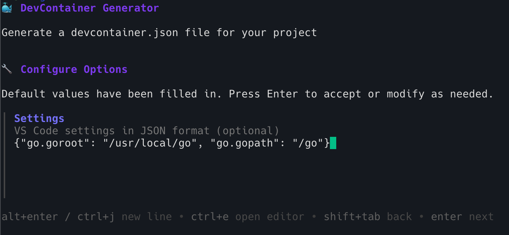

<div align="center">
    <h1>📦 DC Generator</h1>
    
    
</div>

<br />

> Version: **1.0.0**

---

## Table of Contents

- [About](#about)
- [Features](#features)
- [Installation](#installation)
  - [Build](#build)
- [Usage](#usage)
- [Supported Images](#supported-images)
- [Configuration Options](#configuration-options)
  - [Ports](#ports)
  - [Post Create Command](#post-create-command)
  - [Settings](#settings)
  - [Features](#features-1)
- [License](#license)

## About

DC Generator is an interactive command-line tool that simplifies the creation of DevContainer configurations for your projects. With a beautiful terminal UI powered by Charm libraries, it guides you through the process of setting up development containers with predefined templates for popular programming languages and frameworks.

Whether you're working with Node.js, Go, Python, PHP, Rust, .NET, or need a custom setup, DC Generator makes it easy to create a properly configured `devcontainer.json` file with just a few interactive prompts.

<div align="center">
    
    <p><em>Beautiful interactive terminal interface</em></p>
</div>

## Features

- 🎨 **Beautiful Interactive UI** - Powered by Charm's Huh and Lipgloss libraries
- 🚀 **Predefined Templates** - Support for popular languages and frameworks
- ⚙️ **Customizable Configuration** - Full control over ports, commands, settings, and features
- 📁 **Smart Defaults** - Auto-populated configurations based on selected templates
- 🔧 **Custom Images** - Support for custom Docker images
- 📋 **Configuration Preview** - Review your settings before generation
- 💾 **Automatic Directory Creation** - Creates `.devcontainer` folder automatically

## Installation

### Build

1. Clone the repository:

   ```bash
   git clone https://github.com/Zarox28/dc-generator.git
   cd dc-generator
   ```

2. Build the binary:

   ```bash
   go build -o build/dc-generator
   ```

3. (Optional) Install globally:

   ```bash
   sudo cp build/dc-generator /usr/local/bin/
   ```

## Usage

1. Navigate to your project directory:

   ```bash
   cd your-project-directory
   ```

2. Run DC Generator:

   ```bash
   dc-generator
   ```

3. Follow the interactive prompts:

   - Enter your project name (defaults to current directory name)
   - Select a base image from the predefined list or choose custom
   - Configure ports, post-create commands, settings, and features
   - Review your configuration
   - Confirm to generate the `devcontainer.json` file

4. The tool will create a `.devcontainer/devcontainer.json` file in your project root.

### Interactive Workflow

The tool guides you through a step-by-step process:

**1. Project Name Configuration**

<div align="center">
    
</div>

**2. Base Image Selection**

<div align="center">
    
</div>

**3. Options**

<div align="center">
    
</div>

**4. Post-Create Command Setup**

<div align="center">
    
</div>

**5. VS Code Settings Configuration**

<div align="center">
    
</div>

**6. DevContainer Features Selection**

<div align="center">
    
</div>

**7. Configuration Summary & Confirmation**

<div align="center">
    
</div>

## Supported Images

DC Generator comes with predefined configurations for:

| Language/Framework | Image                                                    | Default Port | Features                    |
| ------------------ | -------------------------------------------------------- | ------------ | --------------------------- |
| **Bun**            | `oven/bun:latest`                                        | 3000         | Git, Common Utils           |
| **Node.js**        | `mcr.microsoft.com/devcontainers/javascript-node:latest` | 3000         | Git, Common Utils           |
| **PHP 8.2**        | `mcr.microsoft.com/devcontainers/php:8.2`                | 8000         | Composer, Node.js, Git      |
| **Go**             | `mcr.microsoft.com/devcontainers/go:latest`              | 8080         | Git, Common Utils           |
| **Rust**           | `mcr.microsoft.com/devcontainers/rust:latest`            | 8000         | Git, Common Utils           |
| **Python 3.12**    | `mcr.microsoft.com/devcontainers/python:latest`          | 8000         | Git, Common Utils           |
| **.NET 8**         | `mcr.microsoft.com/devcontainers/dotnet:8.0`             | 5000         | .NET SDK, Git, Common Utils |
| **Custom**         | User-defined                                             | User-defined | User-defined                |

## Configuration Options

### Ports

Specify which ports to forward from the container to your host machine. Use comma-separated values for multiple ports (e.g., `3000,8080,9000`).

### Post Create Command

Command that runs after the container is created. Common examples:

- `npm install` (Node.js)
- `pip install -r requirements.txt` (Python)
- `composer install` (PHP)
- `go mod download` (Go)

### Settings

VS Code settings in JSON format. Example:

```json
{
  "terminal.integrated.shell.linux": "/bin/bash",
  "editor.formatOnSave": true
}
```

### Features

DevContainer features to include. Example:

```json
{
  "ghcr.io/devcontainers/features/git:1": {},
  "ghcr.io/devcontainers/features/common-utils:2": {}
}
```

## License

This project is licensed under the AGPLv3 License - see the [LICENSE](LICENSE) file for details.

<div align="center">
Made with ❤️ using <a href="https://github.com/charmbracelet/huh">Huh</a> and <a href="https://github.com/charmbracelet/lipgloss">Lipgloss</a>
</div>
